# Create A Custom Feed Aggregator From Multiple Sources ... In 20 Minutes

**Build a customized feed app with real-time updates from Reddit and BBC News (or any other APIs) using Stream Feed and Zapier webhooks.**

Have you ever had to integrate multiple RSS or webhook feeds into a single stream for an app? This tutorial will explore how to do so quickly and easily. Creating and maintaining a live feed system with multiple users and interactions can take several weeks to develop...unless you're using Stream. 

This post will demonstrate how fast and easy it can be to build a custom feed app when using the [Stream Feed](https://getstream.io/activity-feeds/) infrastructure to do all the heavy lifting.

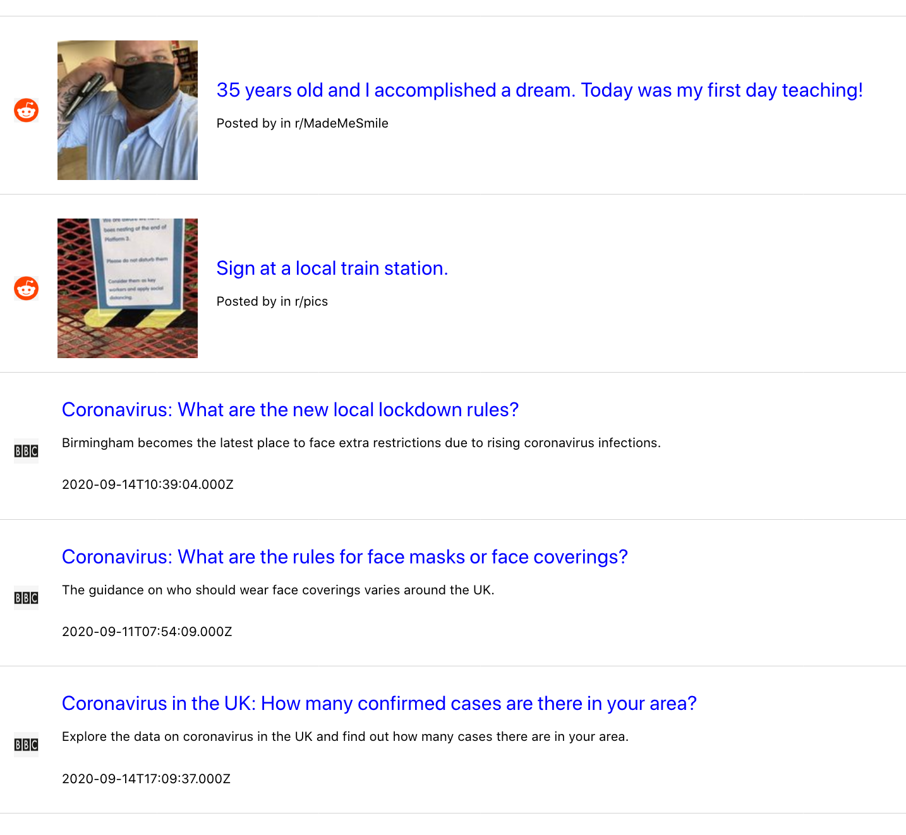

**Work smarter, not harder.** Grab a free Stream trial [here](https://getstream.io/).

We will initialize a Stream Feed with a frontend and backend, then use [Zapier](https://zapier.com/app/dashboard) webhooks to populate the feed in realtime with content from Reddit and BBC News.

>### Stream
>*Build real-time feeds in less time. Leverage Stream's Feed API to build the most engaging activity feed without worrying about the underlying storage technology. Advanced features such as aggregation, ranking, real-time and personalization enable your product team to optimize your app’s engagement and retention.*
>- [Stream Feed](https://getstream.io/activity-feeds/)

### 🎒 Prerequisites

Basic knowledge of [React Hooks](https://reactjs.org/docs/hooks-intro.html) and [Express](https://expressjs.com/) will get you through this tutorial, and the concepts can easily be ported to any other frameworks and languages. This tutorial focuses specifically on feed creation but provides links for detailed instructions on more basic actions throughout. You can follow along using the git repository [here](https://github.com/isaidspaghetti/stream-feedegator).

If you want to build this app from scratch, start by bootstrapping [getstream](https://www.npmjs.com/package/getstream), [react-activity-feed](https://www.npmjs.com/package/react-activity-feed), [express-generator](https://www.npmjs.com/package/express-generator), & [create-react-app](https://www.npmjs.com/package/create-react-app).

## 📖 Outline

Stream handles all the deep-work of this app, so our to-do list is simple:

>* Configure a Stream app
>* Initialize a backend Stream Client
>* Create a backend app registration endpoint
>* Generate a user token
>* Declare a user feed
>* Follow feeds
>* Configure Zapier webhooks
>* Create webhook endpoints that post to feeds

Let's get started!

## 🖋 Frontend Registration Form

The first page a user will encounter in this app is the registration page, which looks like this: 

  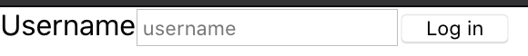

And is rendered by React with the following:

<!-- https://gist.github.com/isaidspaghetti/63a990ab8468a41c7c960c50df81474e.js -->
```jsx
//frontend/src/App.js:68
return (
  <div className="App container">
    <form className="card" onSubmit={register}>
      <label>Username</label>
      <input
        type="text"
        value={username}
        onChange={(e) => setUsername(e.target.value)}
        placeholder="username"
        required
      />
      <button type="submit">
        Log in
      </button>
    </form>
  </div>
);
 ```

When the `Log in` button is clicked, the `register` function is executed:

<!-- https://gist.github.com/isaidspaghetti/aa5893502471ba0e11a6a5f187ed1584 -->
 ```jsx
 //frontend/src.App.js:17
const register = async (e) => {
  try {
    e.preventDefault();

    var response = await axios.post('http://localhost:8080/registration', {
      username: username
    });

    setStreamCredentials({ token: response.data.userToken, apiKey: response.data.streamApiKey, appId: response.data.appId });

  } catch (e) {
    console.error(e, e.error);
  }
};
```

The `register` function makes an `axios` `POST` to our `backend`. The `POST` includes the user's `username`. 

The `backend` will set up a Stream feed client, then respond with a `token` and an `apiKey` to initialize the app in the `frontend` (we'll see how in a moment). Those items get stored in the state variable, `streamCredentials`, which determines if the login screen or feed app is rendered. See below:

<!-- https://gist.github.com/isaidspaghetti/16d0647f03065e4db9489b2a0fb38f81 -->
```jsx
//frontend/src/App.js:43
if (streamCredentials) {
  return (
    // Stream Feed Components
  );
} else {
  return (
    // Registration Component
  );
}
```

>*Note*: Obviously, one should secure their app with some authentication and authorization, but those topics are out of the scope of this post.

Before we can get to setting up the `backend` `registration` endpoint, we need to initialize the Stream app from the Stream Dashboard.

## 🔨 Configure Your Stream App
First, to communicate with Stream, we need to get a Stream API key and secret. Grab your free Stream trial [here](https://getstream.io/), and see [this post](https://getstream.io/blog/send-chat-transcripts-to-hubspot/) for help with signing up.

Once you're signed up, create a Stream Feed app:

1. From the Stream [Dashboard](https://getstream.io/dashboard/), click the `Create App` button.

    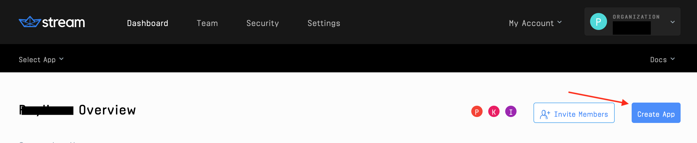

2. Choose any name for the app, and select `development` mode.

    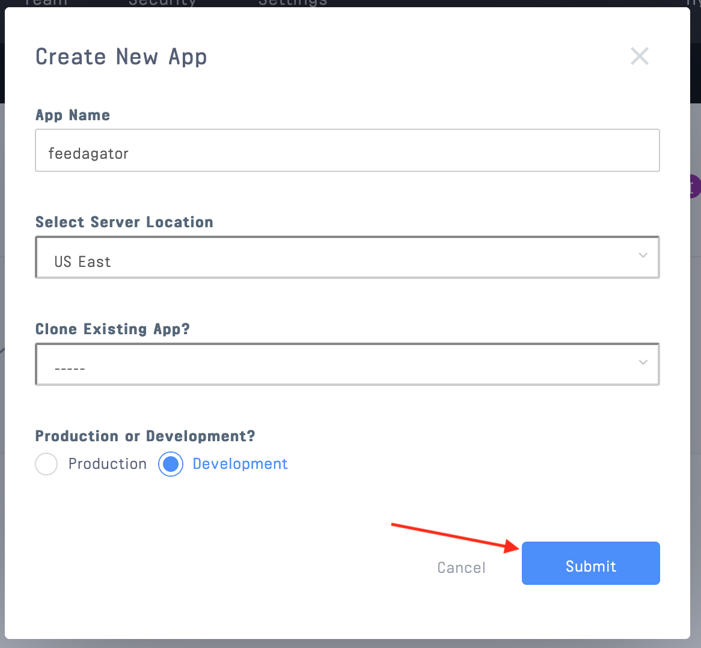

3. In the App Dashboard, add two new `feed groups` to your app. Name them `source` and `user`, and use the default `flat` group type.

    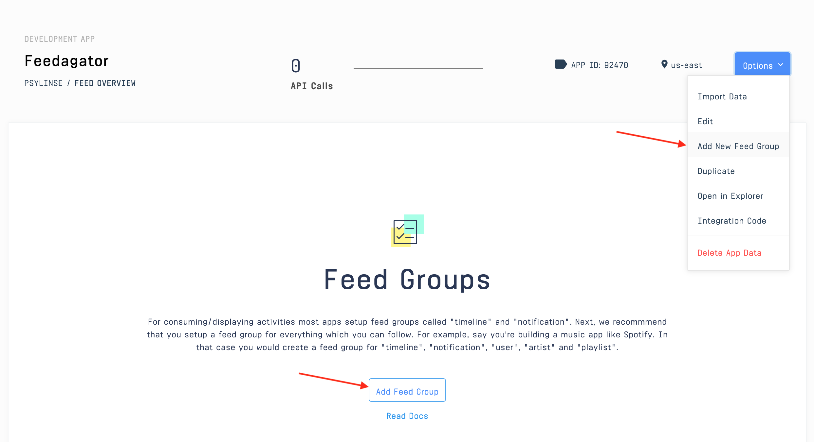 

    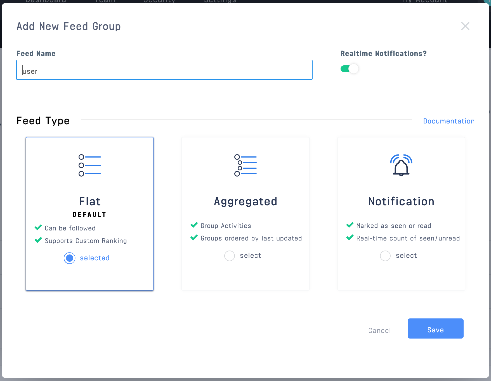

Your app's feed groups should now look like this:

  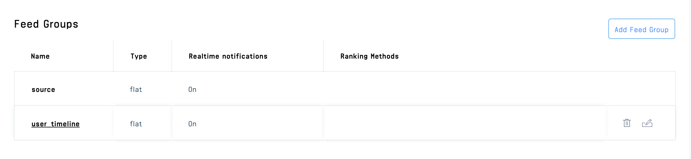

### 🤷🏻‍♀️ Wait, what are **feed groups**? 
>* [Feed groups](https://getstream.io/docs/creating_feeds/?language=js) are a powerful Stream tool that you can use in any way your application would benefit. 
>* An app like Spotify might have one feed group for user listening activity, another for new artists or albums, and another for user notifications. 

### 👍 Cool, so what's a **feed group *type***?
>* [Feed group *types*](https://getstream.io/docs/flat_feeds/?language=js) have different behavior settings. 
>* For instance, `Flat type` feed groups are the only feeds that can be followed.
>* Flat feeds can also be used to consume activities from other feeds - in a "timeline-like" manner.
>* `Aggregated type` feeds are helpful for grouping similar `activity` types (EG: "4 users liked your photo!").
>* `Notification type` feeds can keep track of whether an `activity` is `unseen` or has been `seen`.
>* Get creative with your `custom` feed groups to customize Stream's feeds to your needs. ⏩

Back to the Stream set-up...

4. This app uses a `dotenv` configuration. Copy the API key, API secret, and app ID from the app dashboard and paste them into the file named `.env.example`. Change the filename to just `.env`

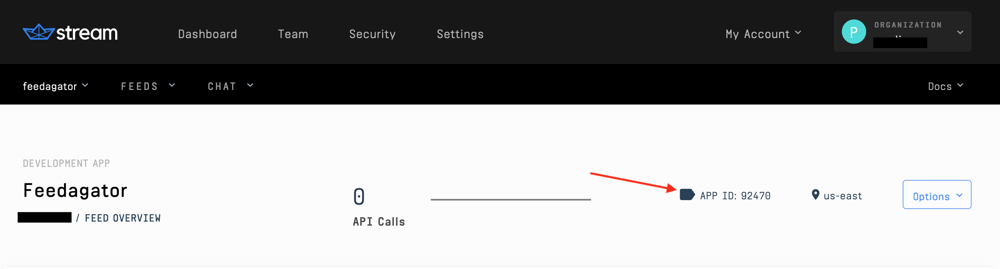

  <!-- https://gist.github.com/isaidspaghetti/75606580cc89b45e1a0d9939d2e72937 -->
    ```bash
    //backend/.env
    NODE_ENV=development
    PORT=8080

    STREAM_API_KEY='your stream api key here'
    STREAM_API_SECRET='your stream secret here'
    STREAM_APP_ID='your app id here'
    ```

5. Finally, declare the environment variables for the API key and secret, and instantiate a new server-side Stream client:

<!-- https://gist.github.com/isaidspaghetti/67c03250febf6b6f3141654fc92ff2c2 -->
    ```jsx
    //backend/routes/index.js:9
    const streamApiKey = process.env.STREAM_API_KEY;
    const streamApiSecret = process.env.STREAM_API_SECRET;
    const appId = process.env.STREAM_APP_ID;

    const client = stream.connect(streamApiKey, streamApiSecret);
    ```

Now we're ready to build the `backend` `registration` endpoint.

### 👨🏼‍🏫 Good to know:
>Stream takes care of all of the complex feed infrastructure for us. Each time we use a `client` method, that's Stream doing its magic. 🧙‍♂️

## Backend Registration Endpoint

The `registration` endpoint performs the following:

1. Normalize the user input -- Stream usernames can include `a-z`, `A-Z`, and `0-9`

2. `createUserToken`

3. `getOrCreate` a Stream `user`

4. Initialize a `userFeed`

5. Follow the `reddit` and `bbc` users

6. Respond to the `frontend`

Here's the code for the tasks above:

<!-- https://gist.github.com/isaidspaghetti/d5e924faa22ca4a2030bd8d2dabcef5b -->
```javaScript
//backend/src/index.js:15
router.post('/registration', async (req, res) => {
  try {
    const username = req.body.username.replace(/\s/g, '_').toLowerCase();

    const userToken = client.createUserToken(username);

    client.user(username).getOrCreate({
      name: username,
    });

    const userFeed = await client.feed('user', username);

    await userFeed.follow('source', 'reddit');

    await userFeed.follow('source', 'bbc');

    res.status(200).json({
      userToken,
      streamApiKey,
      username,
      appId
    });

  } catch (err) {
    console.error(err);
    res.status(500).json({ error: err.message });
  }
});
```

Consider the use of the `'user'` and `'source'` feed groups above. This app uses the `'source'` feed group for content coming from reddit and BBC News, and the `'user'` feed group for the user's `flat` feed. The app would still work if the feed groups were the same, but we recommended using different groups in cases like this. 

So, our `backend` has provided the `frontend` with a `token` and `streamApiKey` so it can start the app. Next, let's see how the feeds are displayed.

## 🔮 Rendering Feeds

Stream has an entire library for React feeds called [`react-activity-feed`](https://getstream.github.io/react-activity-feed/). It includes some slick components with excellent built-in functionality. The next snippet is the heart of the `frontend` and uses a few of these components to render the `user`'s `user` feed.

<!-- https://gist.github.com/isaidspaghetti/726a9b8382bc182c3d3da56664a9a976 -->
```html
//frontend/src/App.js:43
return (
  <div ref={containerRef}>
    <StreamApp apiKey={streamCredentials.apiKey} token={streamCredentials.token} appId={streamCredentials.appId}>
      <div className="stream-app">
        <h3 className="app-title">Feedagator</h3>
        <button onClick={initializeFeeds}>One-time-Initialize</button>
      </div>
      <FlatFeed
        feedGroup="user"
        notify
        options={{ limit: 6 }}
        Paginator={(props) => (
          <InfiniteScrollPaginator
            useWindow={false}
            threshold={10}
            {...props}
            getScrollParent={() => containerRef}
          />
        )}
        Activity={Post}
      />
    </StreamApp>
  </div>
);
```

Let's unpack that...

### The `<StreamApp/>` Component

The `<StreamApp/>` [component](https://getstream.github.io/react-activity-feed/#streamapp) is the wrapping component provided by Stream. It requires the `apiKey` and `token` we just created in the `backend` as props. 

### 💁🏻‍♂️ Developer Testing Button 

>If you don't want to wait for the feed to populate in real-time, this app includes a `one-time-initialize` button to grab the latest posts from our `sources`, and push them to their feeds.  This is for testing and showcasing purposes only. We'll explain how that works later on.

It might take a few seconds for the initialization; you'll know it's done when a message is generated saying you have new notifications.

### The `<FlatFeed/>` Component

The `<FlatFeed/>` [component](https://getstream.github.io/react-activity-feed/#flatfeed) is another built-in from Stream. It requires that we specify which `feedGroup` to display, and accepts several optional arguments. 

We use the `'limit : 20'` property in the `options` prop to determine how many posts should get loaded at a time.

The `Paginator` prop handles scrolling functionality. In this app, we utilize Stream's `<InfiniteScrollPaginator/>` component, which gives our app a nice, modern scroll UX. 

## 🤽🏻‍♂️ Activities
[`Activities`](https://getstream.io/docs/adding_activities/?language=js) makeup a feed. They can be videos, pictures, articles, or anything else a user might post. `<FlatFeed/>` passes each `activity` to be rendered in the `user`'s feed to the `Activity` prop. The `Activity` prop then determines *how* to render each `activity`. 

As you might have guessed, Stream has a built-in `<Activity />` component as well, but for this app we have a specific format in mind, so we'll create a custom component (`<Post/>`) instead. Before we dive into the `<Post/>` component, let's look at how `activities` are generated in Stream.


Learn more about the JSON spec for activities [here](https://activitystrea.ms/specs/json/1.0/).

For this app, we are focused on a single user consuming feeds that are automatically updated by our backend. FYI: Stream can let `frontend` users create `activities` as well.


> ### 🚣🏽‍♂️ Create an Activity
>You only need two methods to create a Stream activity: `.feed()` and `.addActivity()`
>* `.feed()` accepts the feed group and the user
>* `.addActivity ()` accepts an object with 
>   * actor (required)
>   * verb (required)
>   * object (required)
>     * Foreign Id (recommended)
>     * Time (recommended)
>   * any custom properties

So we know how our `activities` will get created, but how are we getting them?

## 🏗 Zapier Webhooks

To keep things simple, we're going to use Zapier 'zaps' (webhooks) to post reddit and BBC News updates to our app. Neither reddit nor BBC News offers webhooks, so Zapier is a great technology to use in this case. They will create a webhook for us based on actions occuring on reddit and BBC News. Let's set up a Zapier account and webhook.

### ⚡️ Build a Zapier + reddit Webhook

1. [Sign up](https://zapier.com/sign-up/?next=%2Fapp%2Fdashboard) for a free Zapier trial.

2. In the [Zapier Dashboard](https://zapier.com/app/onboarding?next=%2Fapp%2Fdashboard) click 'Make a Zap'

    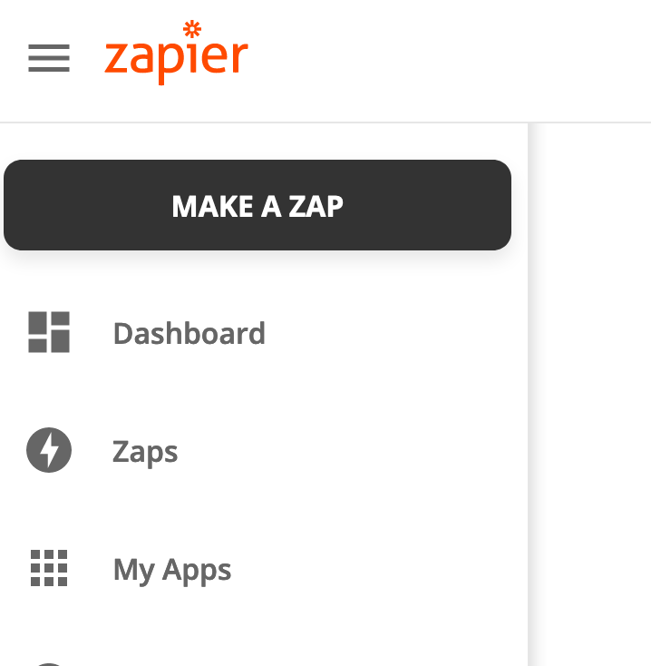

3. Search for and select 'reddit'

    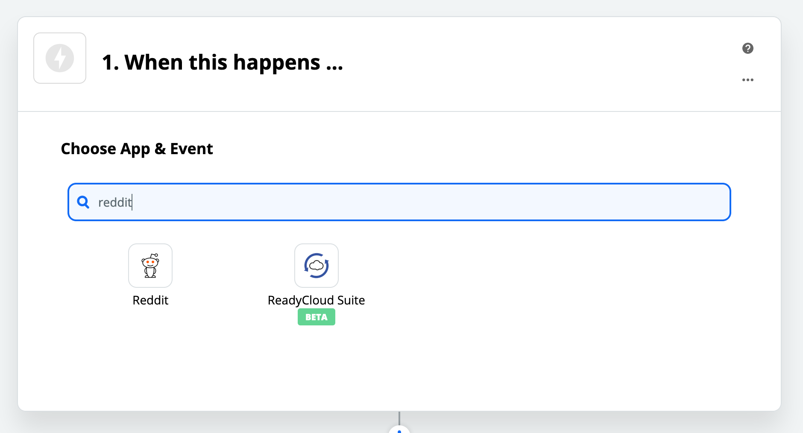

4. Select `New Hot Post in Subreddit` as the triggering action

    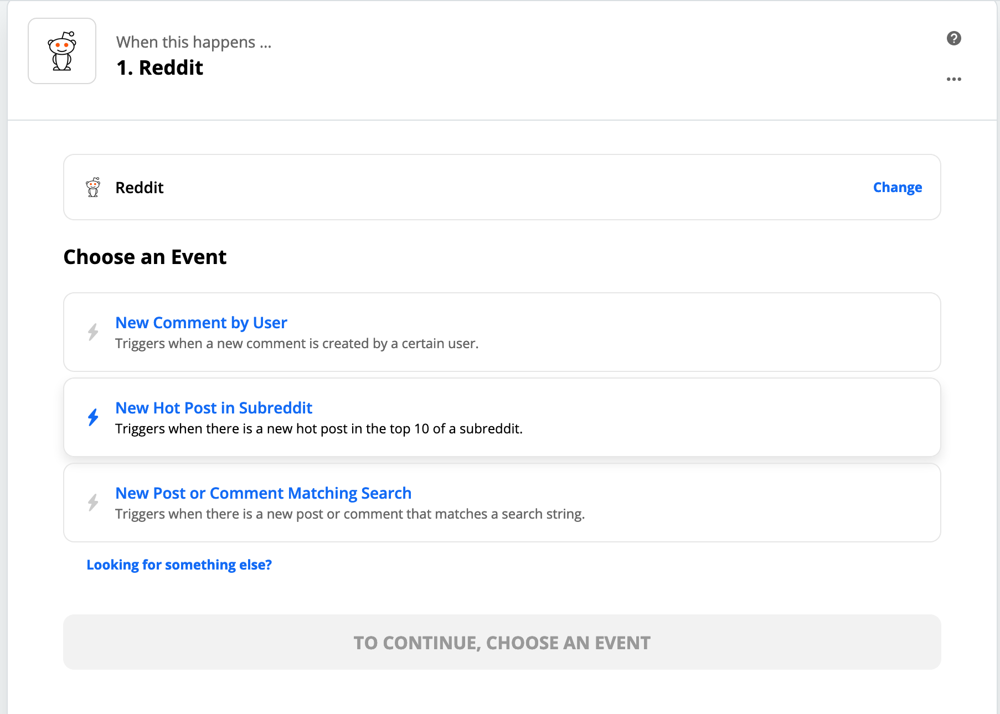

5. Follow the prompts to sign in to your reddit account. If you don't have a reddit account, [sign up here](https://www.reddit.com/register/) (free).

6. Choose a subreddit to receive webhooks for (we used `popular`), test the connection, and continue.

    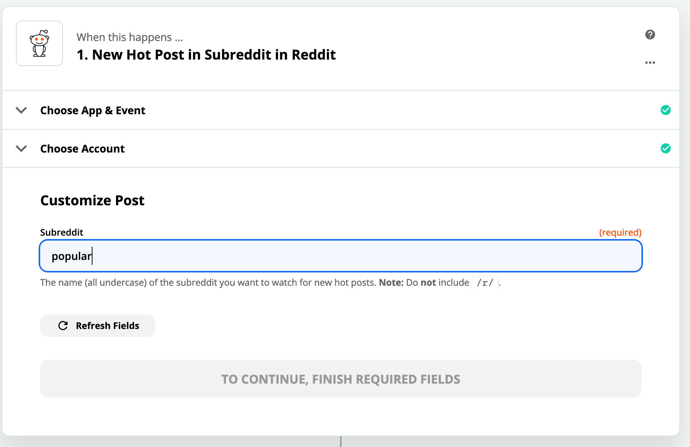

7. Search for and select `Webhooks by Zapier` in the 'Do This' section.

    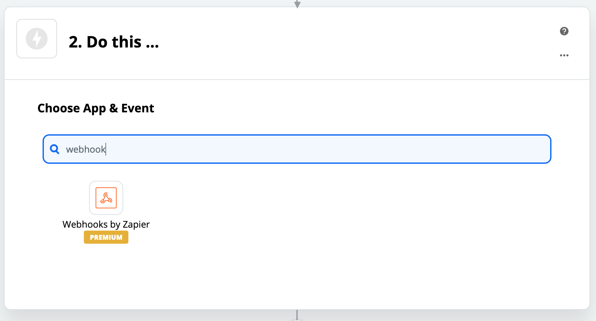

8. Select `POST` and continue. 

>The next step requires a public URL. We're big fans of [`ngrok`](https://ngrok.com/docs)(free), so we used that to tunnel our backend server. (Learn how to use `ngrok` in [this post](https://getstream.io/blog/chat-transcripts-with-sendgrid/)). 

9. Enter your publically accessible URL followed by `/reddit-zapier-webhook` as the `Zapier` URL, select `json` as the `Payload Type`. The `Data` fields (shown below) tell Zapier what information we need in our app. Enter the `key` names as shown in the image below (url, title, author, subreddit, thumbnail, and foreignId) and select the reddit JSON properties accordingly. 

  >**Note:** The values of the reddit properties (grey text in the right column of the image below) will be different in your Zapier dashboard, but the key names coming from reddit should stay the same (URL, Title, Author, Subreddit Name Prefixed, Thumbnail, and ID).

  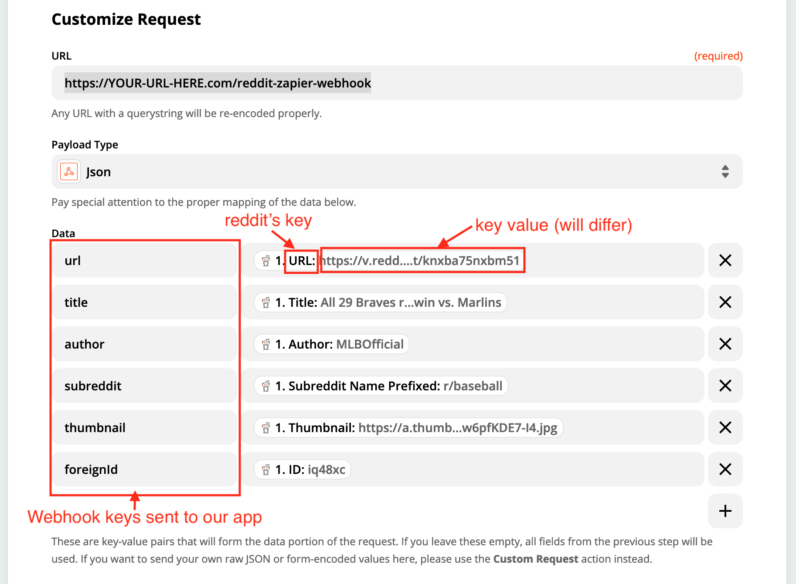

10. Nice! Add `auth` if you need it and continue. 

Let's build a `backend` endpoint to receive the webhook.

### 🔚 Zapier reddit Webhook Endpoint

Back in `backend` land, we have the following endpoint:

<!-- https://gist.github.com/isaidspaghetti/7d581b63ce2b8c7eb9a9079cb7f620af -->
```javaScript
//backend/src/index.js:98
router.post('/reddit-zapier-webhook', async (req, res) => {
  try {
    const redditFeed = await client.feed('source', 'reddit');

    const post = await req;

    await redditFeed.addActivity({
      'actor': 'reddit',
      'verb': 'post',
      'object': post.body.url,
      'title': post.body.title,
      'author': post.body.author,
      'subreddit': post.body.subreddit,
      'thumbnail': post.body.thumbnail,
      'url': post.body.url,
      'foreignId': post.body.id,
    });

    res.status(200).send();

  } catch (error) {
    console.log(error);
    res.status(500).json({ error: err.message });
  }
});
```

This endpoint selects the `redditFeed` as the `client.feed`, await's the request `POST` from Zapier, and uses `.addActivity()` with custom fields matching the Zap json body we just created.

🤙🏽 Sweet! Our app will now create a new activity for the `user` 'reddit' in their `'source'` feed! 

Let's create another Zap for BBC News.

## ⚡️ Create a Zapier Webhook for an RSS Feed 

To get updated on BBC News, we'll request their RSS feed using Zapier. Here's how:

1. Like before, `Create a Zap` from the [Zapier Dashboard](https://zapier.com/app/onboarding?next=%2Fapp%2Fdashboard)

2. Search for and select `RSS by Zapier`

    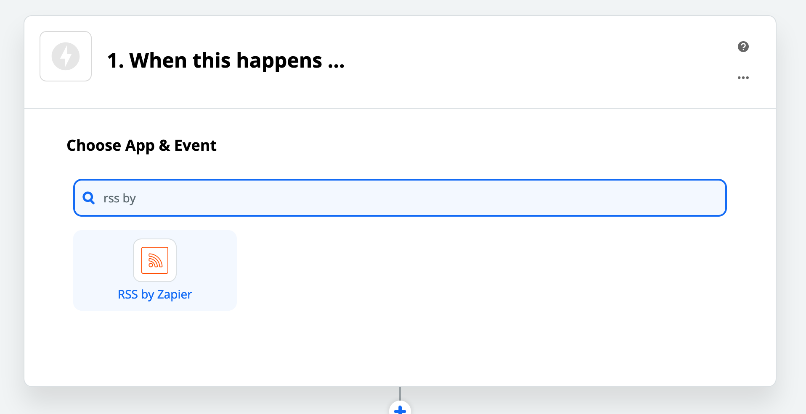

3. Trigger the Zap when BBC posts a `New item` in their feed

    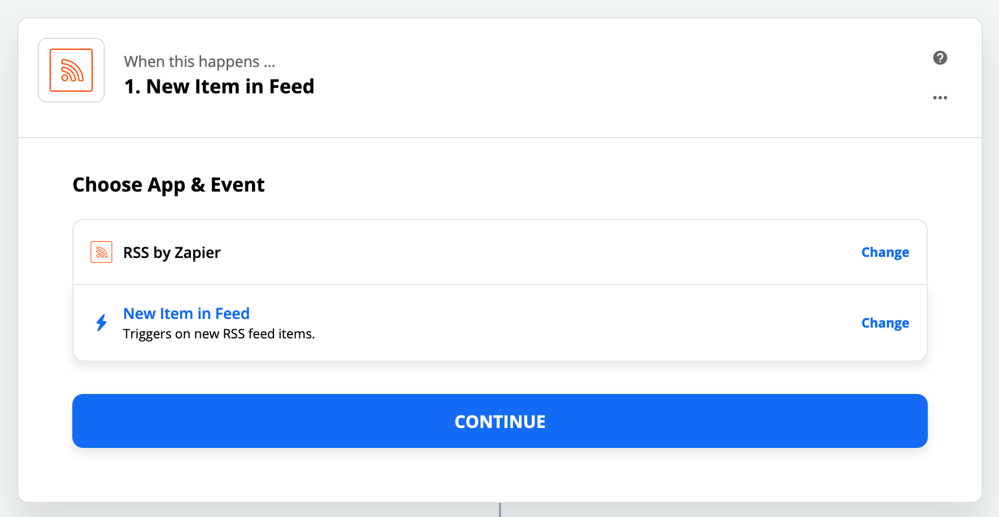

4. For the Zap action, select webhook again

    

5. Continue, and select `POST` as the method

    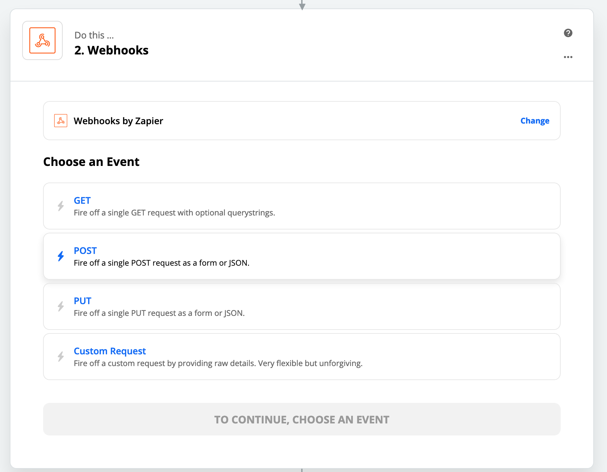

6. Enter BBC's RSS URL (http://feeds.bbci.co.uk/news/world/rss.xml) as shown below for the Webhook

    

7. Use the `POST` settings as shown below, with your URL

    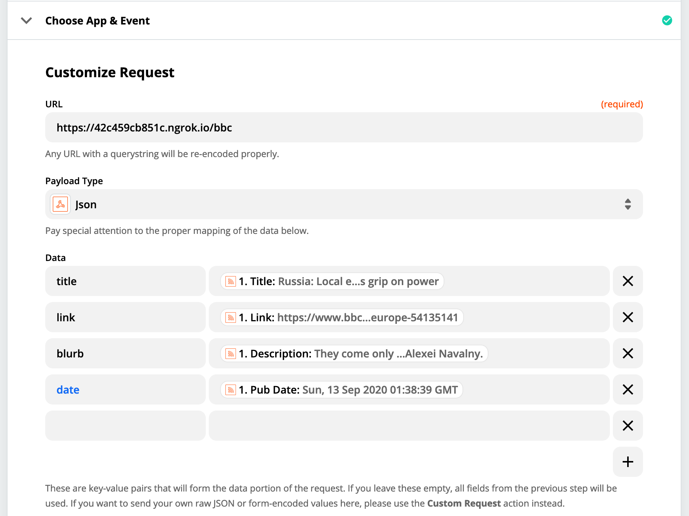

That's all we need on the Zapier side. Here's the endpoint to receive the webhook in `backend`:

<!-- https://gist.github.com/isaidspaghetti/493d9805ef70e773cdb4f22451d80e0e -->
```javascript
//backend/src/index.js:124
router.post('/bbc', async (req, res) => {
  try {
    const bbcFeed = await client.feed('source', 'bbc');

    await bbcFeed.addActivity({
      'actor': 'bbc',
      'verb': 'article',
      'object': req.body.link,
      'title': req.body.title,
      'abstract': req.body.blurb,
      'date': req.body.date,
    });

    res.status(200).send();

  } catch (error) {
    console.log(error);
    res.status(500).json({ error: err.message });
  }
});
```

This is essentially the same as the reddit backend. Test your webhook to be sure it's working properly.

Awesome job! Stream will take care of pushing the feed updates to our frontend user, now let's see how we can do a custom rendering using that `<Post/>` component everyone's been talking about. 

## Custom `<Post/>` Component

The following component determines how the `source` feed activities are rendered. The `props` object below is passed in by `<FlatFeed/>`. It contains all the properties of each feed `activity`. 

<!-- https://gist.github.com/isaidspaghetti/979cefa54ef980f5a59e4850fcbfe1f1 -->
```html
//frontend/src/Post.js:5
const Post = ((props) => {
  if (props.activity.actor === 'reddit') {
    return (
      <div className='post'>
        
        
        <div className="post-content">
          <a className="post-title" href={props.activity.url}>{props.activity.title}</a>
          <p className="subreddit">Posted by {props.activity.author} in r/{props.activity.subreddit}</p>
        </div>
      </div >
    );
  }
  else if (props.activity.actor === 'bbc') {
    return (
      <div className='post'>
        
        <div className="post-content">
          <a className="post-title news-title" href={props.activity.object}>{props.activity.title}</a>
          <p className="abstract">{props.activity.abstract}</p>
          <p className="news-details">{props.activity.date}</p>
        </div>
      </div>
    );
  }
});
```

 We're using slightly different styling depending on if the `activity` comes from reddit or BBC News. The boolean using `props.activity.actor` determines which rendering style to use. The remainder of the snippet uses the properties of each `activity` we sent from the `backend`.

### 👏🏿 Well Done!

You've got a fully functional app! For extra credit, we'll now look at how to initialize the app with that `one-time-use` button.

## ❓ Initialize Demo

What's this button do?

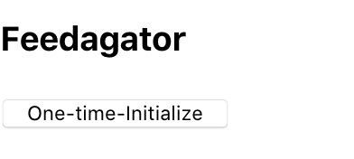

For our one-time development demo, this button will gather some content by requesting the reddit and BBC News APIs manually. Here's the request out of the `backend` to do this:

<!-- https://gist.github.com/isaidspaghetti/65199d8054534e9483a376c5a04bace2 -->
```javaScript
//backend/src/index.js:44
router.post('/initialize', async (req, res) => {
  try {
    await client.user('reddit').getOrCreate({
      name: 'reddit'
    });

    const redditFeed = await client.feed('source', 'reddit');

    const redditUpdate = await axios.get('https://www.reddit.com/r/popular/top.json?count=3');

    const popularPosts = redditUpdate.data.data.children;

    popularPosts.forEach(async (post) => {
      await redditFeed.addActivity({
        'actor': 'reddit',
        'verb': 'post',
        'object': post.data.url,
        'subreddit': post.data.subreddit,
        'title': post.data.title,
        'thumbnail': post.data.thumbnail,
        'url': post.data.url,
        'foreignId': post.data.id,
        'author': post.data.author
      });
    });

    await client.user('bbc').getOrCreate({
      name: 'bbc'
    });

    const bbcFeed = await client.feed('source', 'bbc');

    const parser = new Parser();

    const feed = await parser.parseURL('http://feeds.bbci.co.uk/news/rss.xml?edition=uk#');

    feed.items.forEach(async (article) => {
      await bbcFeed.addActivity({
        'actor': 'bbc',
        'verb': 'article',
        'object': article.link,
        'title': article.title,
        'abstract': article.contentSnippet,
        'date': article.isoDate,
      });
    });

    res.status(200).send();

  } catch (err) {
    res.status(500).json({ error: err.message });
  }
}); 
```

This code initializes the `reddit` user and `redditFeed`. Then, it makes a simple `axios` request to the reddit API. The reddit API returns some of the top `popularPosts`. Then, we use a `forEach` to add each `popularPost` as an `activity` to the `redditFeed.

The same is done for the `bbc` feed. Since we are requesting from an RSS feed, we use the handy `npm` library, [rss-parser](https://www.npmjs.com/package/rss-parser) to parse the data.

The Stream API stores all the activities, so you only need to use this button once. If you need to start with fresh data you can delete your app data in the Stream [Dashboard](https://getstream.io/dashboard/).

## Wrap Up

That's it! Stream makes it super easy to create powerful, customizable, and highly scalable feed apps. 

This app barely skims the surface of Stream. They offer tons of other features including a [machine learning](https://getstream.io/personalization/) engine and consultative engineering team to help you build your feed's intelligence in meaningful ways. Parouse the [Stream Blogs](https://getstream.io/blog/) for more info, and have some fun building your next app!